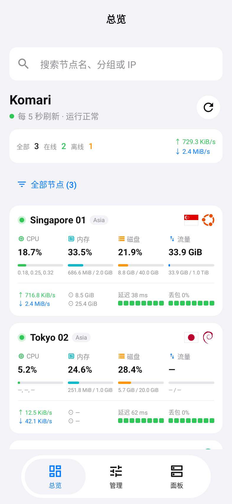
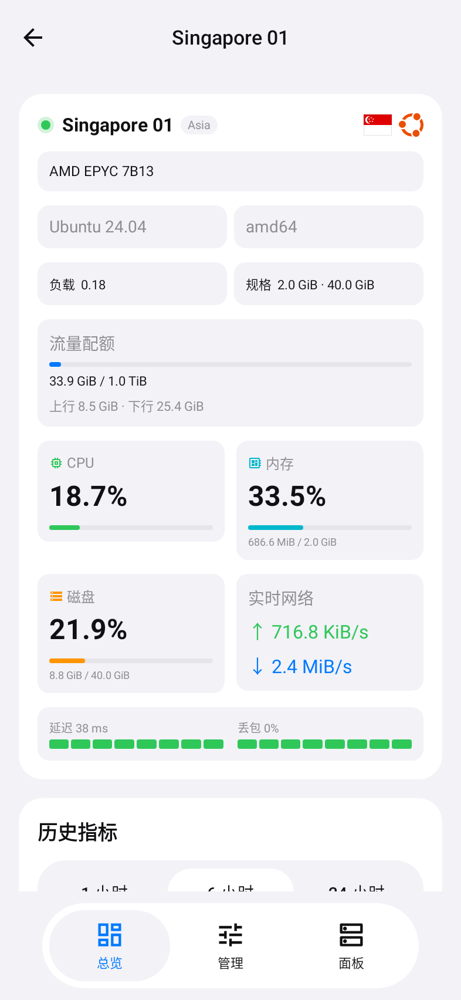

# Monitor Panel — Android port

Native Android port of Monitor Panel iOS 1.0.1 (upstream commit `28cb720`). The iOS project remains in the repository root. Open **this `android/` directory** in Android Studio.

The port follows the original Overview / Manage / Panels navigation, grouped surfaces, four-column node cards, expanded node specifications, history charts, panel-local ordering/hiding, themes, accent colors, and five languages. Original node identity images and their attribution notices are reused.

<p> </p>

Screenshots are rendered from Android UI tests using fixture nodes; the app contains no demo servers.

## Build / install

Requires JDK 17 and Android SDK 35. Minimum device version: Android 8.0 (API 26).

```sh
./gradlew :app:assembleDebug :app:testDebugUnitTest :app:lintDebug
adb install app/build/outputs/apk/debug/app-debug.apk
```

On Windows use `gradlew.bat`. Set `ANDROID_HOME` or `sdk.dir` in an untracked `local.properties` file. The Android GitHub Actions workflow also creates an installable, debug-signed APK artifact. Debug signing certificates can differ between local and CI builds; keep using the same source for updates, or uninstall before switching sources. Production distribution needs a persistent private release signing key; keys must never be committed.

Verified locally: APK signature/package checks, 17 passing contract/UI tests, and Android lint with zero errors. No production monitoring panel was used during testing; actual-device and live-backend acceptance remain to be performed with the owner's configuration.

## Supported original features

- Komari administrator JSON-RPC; Nezha V1 WebSocket and metrics; Nezha V0 API token and ping history; anonymous DStatus API.
- Five-second foreground refresh with cancellation and protection against stale responses when switching panels. Unknown metrics remain unknown; failed refreshes invalidate freshness.
- Node CPU, memory, disk, load, traffic quota, throughput, target-averaged latency/loss, local flags and OS icons, historical metrics and hardware metadata.
- Add, verify, edit, select and remove panels. Local node sorting and hiding, online filter and search.
- Komari node editing; Ping task and load notification creation/edit/deletion; offline notifications; command confirmation, delivery status and results; paginated/filterable audit logs.
- Readback checks and concurrent-edit detection for management rules. Non-idempotent requests are not automatically retried. A submitted edit/command stays locked if delivery or verification is ambiguous.
- System/light/dark appearance, preset and custom HEX accent colors, Simplified/Traditional Chinese, English, Japanese and Korean.

## Platform substitutions

SwiftUI is implemented with Kotlin and Jetpack Compose. iOS Keychain is replaced with AES-GCM encryption backed by a non-exportable Android Keystore key. API keys are not placed in saved screen state, logs, URLs or backups. Valid TLS is required by default; a separate per-panel switch allows HTTP on trusted networks. Redirects, cookies, caches and automatic network retries are disabled.

Apple Liquid Glass and SF Symbols are platform-specific. Android preserves the page structure, spacing, grouped colors and floating capsule navigation using Compose surfaces and Material icons. Android uses its native system font, Back behavior and keyboard. There is no WebView wrapper or embedded replacement web dashboard.

Load notifications retain the original Komari 1.5.x contract. Backends that removed this API report an error. Available history metrics depend on the backend, just as on iOS.

The app contains no built-in server credentials and does not contact a monitoring service until a panel is configured. Test data is restricted to test sources.
